# Design: one Vega-Lite `plot` skill

Status: **proposal for review**. Nothing here is shipped. The prototype under
[`prototypes/`](prototypes/) renders every example in this document from
synthetic weather-skills Zarrs, so each claim below was checked against real
output. The pictures in this document are those renders.

## TL;DR

- One skill, `plot`, replaces `plot`, `plot-timeseries`, `plot-verify` and
  `plot-mediogram`. It depends on Altair and vl-convert. There is no
  matplotlib, seaborn, Cartopy or nc-time-axis.
- The agent writes a **plain Vega-Lite spec**. There are three extension
  points, and everything else is upstream Vega-Lite:
  1. **Bindings.** An entry under the top-level `datasets` may be a binding
     object instead of rows. The binding names an input Zarr and maps
     columns to dims, coords or variables. The skill replaces the binding
     with rows. Layers point at the data with Vega-Lite's own
     `{"data": {"name": "obs"}}`.
  2. **Placeholders.** A small set of `$`-prefixed objects (`$palette`,
     `$colorbar`, `$bbox`, `$label`, `$attr`, `$extent`) expand to concrete
     Vega-Lite values that are computed from the data or from the dev
     palettes.
  3. **`usermeta`.** Skill switches go here, for example
     `usermeta.seal_cells`. Vega-Lite ignores `usermeta` by definition.
- The CLI is
  `plot.py -i obs=chirps.zarr -i stations=st.zarr --spec spec.json -o out.png`.
  Inputs are named, so a spec can refer to them by name.
- The pipeline is: bind, then expand placeholders, then lint fields, then
  validate with Altair (which also picks `Chart`, `LayerChart`, `HConcatChart`
  and so on), then compile to Vega, patch the cell seams, render the PNG with
  vl-convert, and stamp provenance with the core `@weather_skill` decorator.
- Defaults are minimal. Vega-Lite's own defaults apply everywhere. The only
  thing carried over from dev is the **palette tables**, which include the
  aggregation-period-aware `default_precip` and `default_precip_anom`. They
  come with one helper, `$colorbar`, which draws an equal-width classed
  colorbar. Vega legends cannot draw one.

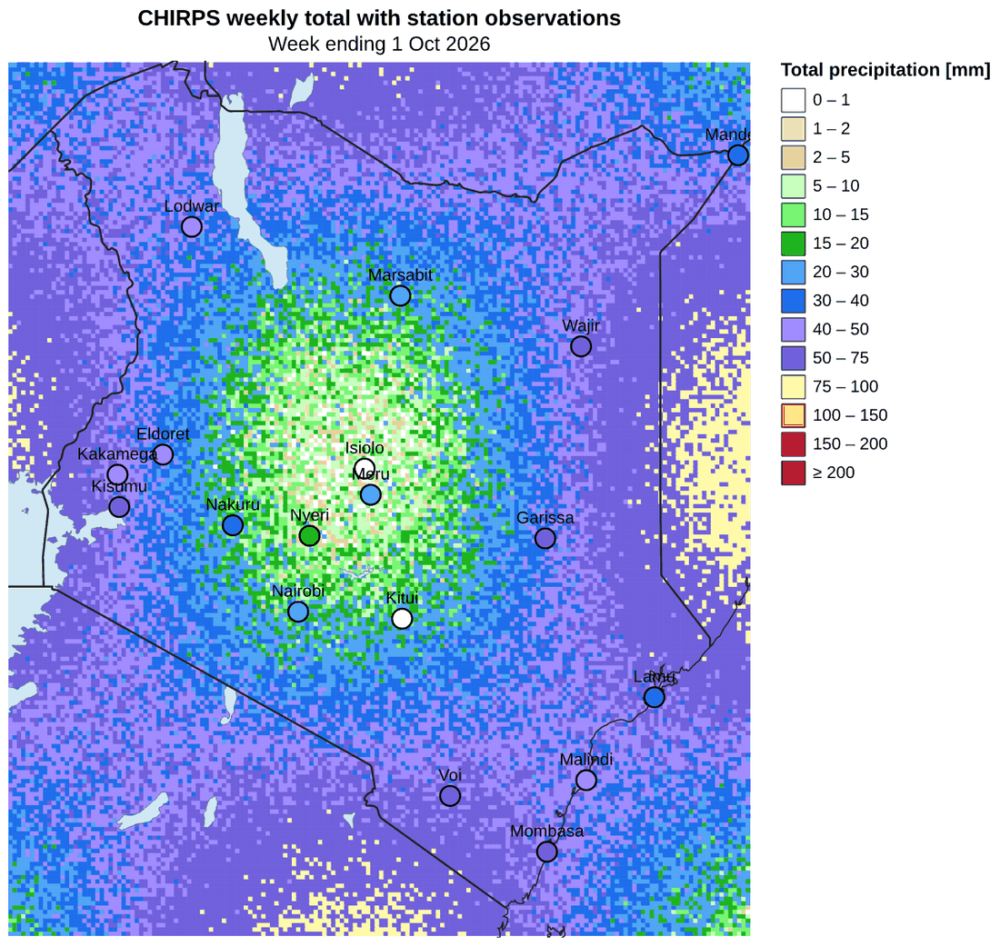

## Goals and non-goals

**Goals**

- The agent controls every element of the figure through one declarative
  document, the Vega-Lite spec. The skill adds no layout or styling opinions
  on top.
- There is a thin, explicit way to say which input, which slice and which
  dims or variables become which columns.
- The common weather figures are recipes, not features. These include a grid
  heatmap over a base map with station dots, faceted lead maps, classed and
  diverging anomalies, quiver, contours, time series, ensemble spaghetti with
  bands, multi-panel time series, grouped bars, box or mediogram plots and
  the wind rose.
- Errors are actionable. They name the JSON path, list the valid keys or
  columns, and never fall back silently.
- Provenance stamping and the QA lines work the same way as the current
  skills.

**Non-goals**

- No plotting vocabulary of our own. There is no `traces[]`, `subplots[]` or
  `layout.facet`. If Vega-Lite can express something, the agent writes it in
  Vega-Lite.
- No data reduction in the plot skill. Leftover dims are an error and are
  never averaged for the agent. Reductions belong to `aggregate-temporal`,
  `reduce`, `difference` and similar skills. Small chart-local summaries
  remain available through Vega-Lite transforms (`aggregate`, `quantile`,
  `window`, `pivot`).
- No interactive features. Rendering is static (PNG, plus optional HTML).
  Vega-Lite `params` still compile but are not supported.

## What carries over from dev, and what is dropped

| Area | Dev branch | New skill |
| --- | --- | --- |
| Spec language | Custom (`traces`, `inputs`, `subplots`, `layout`, `theme`, `geo`, `annotations`, `shapes`), compiled to matplotlib | Vega-Lite 6 (schema `v6.json`), plus bindings, placeholders and `usermeta` |
| Renderer | matplotlib + Cartopy, constrained layout | vl-convert (Deno + resvg, no browser) |
| Palettes | `theme.py` colour tables and window selection | **Kept** as data. The seaborn or matplotlib calls go. |
| Precip window logic (`aggregation_period`, then `ppt_daily`/`week`/`month`/`season`) | `default_precip_scale_name` | **Kept**, behind `$palette: "default_precip"` and `"default_precip_anom"` |
| Classed colorbar look (equal widths, under/over triangles) | matplotlib `extend="both"` | **Kept**, as the `$colorbar` placeholder |
| Units in labels (`°C`, not `degC`) | core `format_units_for_display` | **Kept**, as `$label` |
| Map overlays | Cartopy `NaturalEarthFeature` | Natural Earth GeoJSON bindings (`naturalearth: borders`, and so on) |
| Seaborn templates, `rocket`, `along` colour cycles, fontsize defaults, DPI, max columns, theme files, `WEATHER_SKILLS_PLOT_THEME` | `theme.py` | **Dropped.** Vega-Lite `config` covers these, and Vega schemes cover continuous colour maps (`viridis`, `magma`, `blues`, `redblue`, `brownbluegreen`, ...). |
| Kind-specific CLIs (`--obs`/`--forecast`/`--verify`, `--layer KIND:PATH`, `--x`/`--y`) | 4 skills | **Dropped.** There is one `-i NAME=PATH` that can repeat. |
| QA stdout (pixel hash, data status) | `qa.py` | **Kept** unchanged. It only needs PIL and numpy. |
| Provenance stamp and circular mark | core decorator | **Kept** unchanged. No core change is needed. |

## Architecture

```text
 -i obs=chirps.zarr ─┐                     ┌───────────── spec.json (Vega-Lite + bindings) ─────────────┐
 -i st=stations.zarr ┼─► @weather_skill ───┤                                                            │
 --geojson ...      ─┘   opens + hashes    ▼                                                            │
                         inputs        1. bind      datasets.<name>: binding → rows (tidy records)       │
                                       2. expand    $palette / $colorbar / $bbox / $label / ... → values │
                                       3. lint      every encoding field exists in its dataset          │
                                       4. validate  Altair: dispatch on top-level key, schema check     │
                                       5. compile   vl_convert.vegalite_to_vega (VL 6.4)                 │
                                       6. patch     seal_cells (rect seams)                              │
                                       7. render    vl_convert.vega_to_png(scale=2)  /  HTML             │
                                       8. return Path ─► decorator stamps provenance (+ mark), QA lines  │
```

Each step is a pure function, and the library exposes them separately
(`bind`, `expand`, `lint`, `validate`, `compile`, `render`). This lets tests
and the `--describe` and `--dump-spec` modes stop at any stage.

### Why bindings live inside `datasets`

Vega-Lite allows named datasets only at the top level (`datasets`). Any unit,
layer, facet or concat can then refer to one by `{"data": {"name": ...}}`.
Putting the binding in that slot gives us these properties:

- The rest of the spec is untouched, valid Vega-Lite. Upstream docs, Vega
  Editor examples and Altair's `to_dict()` output all apply directly.
- One binding can feed any number of layers and panels. For example, the
  station rows feed both the dots and the labels.
- The spec is self-describing. Everything that defines the figure lives in
  one JSON object, which is what provenance records.

Alternatives considered:

- **A separate `--bind name=zarr:...` flag.** This splits one figure across
  two documents, and per-column options do not fit on a CLI.
- **Inline `"data": "$fcst"` strings.** These break Vega-Lite schema
  validation of the template, and the same data has to be re-declared in
  every layer.
- **Agents writing Altair Python.** That means code execution rather than
  a declarative spec, and there would be nothing to validate or record.

### Dispatch

Altair needs to know the top-level class before it can validate or convert.
The skill picks it from the keys:

| Top-level key | Altair class | Typical use |
| --- | --- | --- |
| `mark` | `Chart` | Single bar chart, single line |
| `layer` | `LayerChart` | Map with base layers and stations, spaghetti with mean and band |
| `hconcat` / `vconcat` / `concat` | `HConcatChart` / `VConcatChart` / `ConcatChart` | Side-by-side grids, maps above a colorbar, multi-panel time series |
| `facet` + `spec` | `FacetChart` | Lead-week maps, one panel per station |
| `repeat` + `spec` | `RepeatChart` | Same chart for several variables |

If none or more than one of these keys is present, the skill fails with a
message that lists the choices. Nested composition, such as a facet inside a
vconcat (see [the colorbar example](#lead-week-maps-sharing-one-classed-colorbar)),
is plain Vega-Lite and needs no dispatch.

## Command line

```bash
uv run ${CLAUDE_SKILL_DIR}/scripts/plot.py \
    -i obs=/tmp/chirps_week.zarr -i stations=/tmp/stations_week.zarr \
    --spec /tmp/map.json -o /tmp/map.png
```

| Flag | Meaning |
| --- | --- |
| `-i`, `--input NAME=PATH` | An input Zarr, which can repeat. `NAME` is what a binding's `"zarr"` refers to. A single bare `PATH` is named `data`. Inputs go through the core decorator, so they are opened, contract-checked and hashed into provenance. |
| `--geojson NAME=PATH` | Extra vector layers, such as a region polygon from `resolve-region`. Bind them with `{"geojson": "NAME"}`. These files are recorded by sha256 in the provenance parameters. |
| `--spec JSON\|PATH\|-` | The Vega-Lite spec with bindings. It can be inline JSON, a file, or stdin. |
| `-o`, `--output PATH` | A `.png` file (the default), `.jpg`, or `.html` (self-contained, with the data inlined). These are the formats core's `stamp_figure` accepts. |
| `--scale N` | The pixel ratio, default `2`. A 640-wide spec gives a 1280-pixel PNG. |
| `--describe` | Opens the inputs and prints, for each one, its dims, sizes, coords, variables (with `long_name`, `units` and `aggregation_period`) and the derived sources that are available. For each binding in `--spec`, if one is given, it also prints the columns and row count it would produce. Nothing is rendered. This is the step an agent runs before writing a spec. |
| `--dump-spec PATH\|-` | Writes the final Vega-Lite after binding and expansion and skips rendering. The output pastes into the [Vega Editor](https://vega.github.io/editor/) as-is. Add `--dump-spec-rows N` to truncate each dataset for reading. |
| `--max-rows N` | Raises the row guard (see [Limits](#performance-and-limits)). |

The `zarr_paths()` hook in the decorator means named inputs need no core
change. The skill wraps the `-i` list in a small holder that exposes
`zarr_paths()`. The decorator opens and validates the inputs, hashes them and
attaches `.datasets`, and the skill maps the names back.

## The spec: bindings

A binding is an object under `datasets.<name>` that has exactly one of the
keys `zarr`, `geojson` or `naturalearth`. A plain list of rows passes through
unchanged.

### `zarr`: tidy rows from an input

```json
"datasets": {
  "obs": {
    "zarr": "obs",
    "bbox": [5, 33.5, -5, 42],
    "sel": {"time": "2026-10-01"},
    "fields": {"lon": "longitude.lo", "lon2": "longitude.hi",
               "lat": "latitude.lo",  "lat2": "latitude.hi",
               "precip": "precip"}
  }
}
```

| Key | Meaning |
| --- | --- |
| `zarr` | The input name from `-i NAME=PATH`. |
| `fields` | **Required.** A map from column name to source. A source is a data variable, a dim, a non-dim coord (such as `station_name`), or a derived source (see the next table). There must be at least one variable. Each listed dim becomes a column, and rows are the cartesian product over those dims (`to_dataframe`). |
| `sel` | Label selection on dims. Scalars use `method="nearest"` for numeric and time dims. Lists select several values. `{"start","stop","step"}` is a slice. Timedelta dims accept `"7D"` and datetime dims accept ISO strings. |
| `isel` | Positional selection with the same forms. `{"latitude": {"step": 3}}` thins quiver arrows. |
| `bbox` | `[N, W, S, E]` crop. It works on gridded data in either latitude order, and masks point data (stations). |
| `dropna` | The default `true` drops rows where every variable is NaN, such as ocean cells in land-only products. |
| `cell_overlap` | An opt-in fraction (for example `0.25`) that widens `.lo`/`.hi` edges. Normally `seal_cells` makes this unnecessary. |

Derived sources:

| Source | Value |
| --- | --- |
| `<dim>.lo`, `<dim>.hi` | Cell edges from 1-D centres: midpoints, with the end cells mirrored. Used with `rect` and `longitude`/`longitude2`/`latitude`/`latitude2` to draw grid cells at their true size on any grid spacing. |
| `valid_time` | `time + step` for forecasts (init plus lead). |
| *(planned)* `<var>.flag` | The CF `flag_meanings` label for an integer flag variable, for example hit, miss or false alarm in a verify Zarr. |

Rules:

- **Leftover dims are an error.** A dim that has more than one value, is not
  a column, and was not reduced by `sel`/`isel` is an error. The message
  names it and suggests `sel`, adding it to `fields`, or an upstream
  reduction. Size-1 dims are squeezed.
- **Datetimes become UTC epoch milliseconds,** not ISO strings. Vega-Lite
  only parses ISO strings for datasets that feed a temporal encoding. A
  `lookup` join between a parsed and an unparsed dataset then silently
  matches nothing. Epoch milliseconds are unambiguous. The skill sets
  `TZ=UTC` as well, because the renderer's JS runtime otherwise parses
  dates in local time.
- **Timedeltas become float days.** This gives `lead_days / 7` arithmetic
  for "Week N" facet labels.
- Unknown sources fail with the input's dims, coords and variables listed.

### `contours`: filled bands or isolines

Vega-Lite has no contour mark. A `zarr` binding with a `contours` block
traces a 2-D field with [contourpy](https://contourpy.readthedocs.io/) and
emits GeoJSON features, which a `geoshape` mark then draws:

```json
"bands": {"zarr": "fcst", "sel": {"step": "7D"},
          "contours": {"variable": "tp", "levels": [0, 5, 10, 20, 30, 40, 50, 75, 100, 150, 200], "filled": true}},
"lines": {"zarr": "fcst", "sel": {"step": "7D"},
          "contours": {"variable": "tp", "levels": [10, 30, 50, 75]}}
```

Bands carry `properties.lo`, `properties.hi` and `properties.mid`. Colour
them with `"field": "properties.mid"` and the same `$palette` as a heatmap.
Lines carry `properties.level`.

### `naturalearth`: base-map layers

```json
"borders": {"naturalearth": "borders", "scale": "10m", "bbox": [5, 33.5, -5, 42]}
```

- The layers are `countries`, `borders` (land boundary lines), `coastline`,
  `lakes`, `rivers`, `admin1`, `ocean` and `land`. Scales are `10m`, `50m`
  and `110m`.
- Sources are the [natural-earth-vector](https://github.com/nvkelso/natural-earth-vector)
  GeoJSON files, **pinned to `v5.1.2`**. Each file is downloaded once into a
  cache (`WS_NE_CACHE`, defaulting to `~/.cache/weather-skills/naturalearth`).
  Its sha256 goes into the provenance parameters.
- Offline fallback: `countries` and `borders` at 110m fall back to the
  `countries.geojson` that core already ships. Other layers fail with a clear
  "no network and no cache" error.
- Features are clipped to `bbox` plus a 1° pad with shapely. This keeps the
  10m files to kilobytes: the Kenya example binds 15 lake features, 7
  coastline features and 15 border features. Rings are re-oriented to
  clockwise for d3 (see [Gotchas](#gotchas-found-while-prototyping)).
  `properties` are reduced to `name` unless `"properties": [...]` asks for
  more.

### `geojson`: agent-supplied vectors

`{"geojson": "region"}` loads `--geojson region=/tmp/kenya.geojson` (or a
path). It accepts `bbox` and applies the same clipping and orientation as
`naturalearth`.

## The spec: placeholders

A placeholder is an object whose only `$` key is one of the names below.
Expansion replaces the whole object. `$schema` is not a placeholder. An
unknown `$` key is an error that lists the known ones, and only one
placeholder is allowed per object. Data references take the form
`"<dataset>.<column>"` and resolve to the bound DataArray **after**
`sel`/`bbox`, so palettes and extents see exactly the plotted data.

| Placeholder | Expands to | Example |
| --- | --- | --- |
| `{"$palette": NAME, "data": "obs.precip", ...extra}` | A `threshold` scale `{type, domain: bounds, range: [under, *classes, over]}`. Extra keys such as `clamp` merge in. `NAME` can be a dev palette or an inline `{colors, bounds, under, over}`. | `"scale": {"$palette": "default_precip", "data": "obs.precip"}` |
| `{"$colorbar": NAME, "data": ..., "length", "thickness", "orient", "extend", "title", "label_size"}` | A complete unit chart drawing an equal-width classed colorbar with under/over triangles, for use as a concat panel. | See [below](#palettes-and-the-classed-colorbar) |
| `{"$bbox": [N, W, S, E]}` or `{"$bbox": "dataset"}` | A GeoJSON `MultiPoint` of the two corners, for `projection.fit`. The dataset form uses the cell-centre extent of a binding. | `"projection": {"type": "equirectangular", "fit": {"$bbox": [5, 33.5, -5, 42]}}` |
| `{"$label": "obs.precip"}` | `"<long_name> [<units for display>]"`, for example `Total precipitation [mm]` or `2 metre temperature [°C]`. | `"title": {"$label": "ens.t2m"}` |
| `{"$attr": "obs.precip.aggregation_period"}` | That attribute as a string. | Subtitles |
| `{"$extent": "anom.tp", "symmetric": true}` | `[min, max]` of the bound data, or `[-m, m]` when symmetric. | `"domain": {"$extent": "anom.tp", "symmetric": true}` |

Placeholders are kept to values that Vega-Lite cannot compute from the rows
it sees. Palettes come from Python tables. The precip window depends on the
`aggregation_period` attribute. Labels and units live in attributes. A
pre-computed extent stays stable across facets and concat panels. Everything
else, such as scales, legends, axes, titles, formats and transforms, is
written in Vega-Lite directly.

## Palettes and the classed colorbar

The `$palette` names come directly from dev's `theme.py`: `default_precip`,
`default_precip_anom`, `ppt_daily`/`week`/`month`/`season`,
`ppt_anom_daily`/`week`/`month`/`season`, `ppt_short`, `ppt_total`,
`ppt_poa`, `ppt_spp`, `chirps_short`, `chirps_total` and `spi`.
`default_precip` picks the nested window from the variable's
`aggregation_period` attribute, exactly as dev does: a 7D total gets
`ppt_week`, which runs from 0 to 200 mm with an over class. Continuous maps
use Vega schemes, so the old `viridis` and `rocket` entries are not
palettes. Use `"scheme": "viridis"` or `"magma"` instead.

The **classed colorbar problem** is that Vega's legend for a threshold scale
is a "discrete gradient" sized by value. On the precip ladder
(0, 1, 2, 5, 10, ..., 200), the 0–1 and 1–2 mm classes become slivers, and
`symbolType` or `type: symbol` does not change that. The heatmap image at
the top shows the native legend. `$colorbar` instead builds a small unit
chart with one equal-width rect per class, labels at the class edges and
triangles for under and over. You put it in a `vconcat`/`hconcat` beside
the map and set `"legend": null` on the map's colour channel:

```json
"vconcat": [
  {"data": {"name": "fcst"}, "facet": {"field": "week", "type": "ordinal", "title": null}, "columns": 4,
   "spec": {"...": "map layers; color uses $palette default_precip with legend: null"}},
  {"$colorbar": "default_precip", "data": "fcst.tp", "length": 560, "thickness": 14}
]
```

### Lead-week maps sharing one classed colorbar

[`examples/map_forecast_leads_colorbar.json`](examples/map_forecast_leads_colorbar.json)

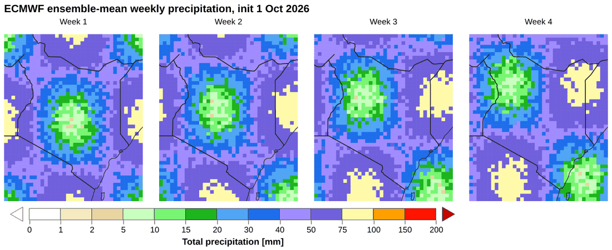

The native legend is still the right choice for continuous scales and short
class ladders. The skill does not choose between them; the agent writes one
or the other.

## Output, provenance and QA

- The skill function returns the output `Path`. `@weather_skill` stamps it
  through core's `stamp_figure`, which works the same as today. PNG and JPEG
  get embedded history plus the circular mark when the provenance chain is
  intact. HTML gets a `<meta name="weather_skills_history">` tag and no mark.
- Provenance parameters record the **agent's spec before binding**, the
  input names and paths, and the hashes of any `--geojson` and Natural Earth
  files. They do not record the bound rows, which are just the inputs again,
  and they would make the record megabytes long.
- The stdout QA lines from `qa.py` are kept. `plot hash` is the sha256 of
  the RGB pixels. `data status` reports finite and NaN counts for each
  plotted variable, computed from the bound DataArrays rather than whole
  inputs, so a `sel` that picks an all-NaN slice is flagged.
- Each binding's row count also goes to stdout, for example
  `bound obs: 34000 rows (lon, lon2, lat, lat2, precip)`. The agent can then
  catch an empty `sel` before looking at the image.

## Validation and error messages

Several checks run in order, and the first failure stops the render:

1. **Binding errors** (`SpecError`) name the dataset and key, for example
   `datasets.obs: dims {'number': 11} are not columns in fields and have
   more than one value. Add each one to fields, pick one value with
   sel/isel, or reduce it upstream (reduce, aggregate-temporal). Nothing is
   averaged for you.`
2. **Placeholder errors** give the JSON path and list the known names.
3. **Field lint.** Every `encoding.*.field` must be a column of the dataset
   the unit draws from, or a name produced by a transform (`as`, aggregate,
   window, fold, quantile). Pivots switch the check off for that subtree.
   Vega-Lite itself draws nothing for an unknown field and raises no error.
   This check catches the most common silent failure.
4. **Schema validation** runs through Altair on a copy that keeps only 3
   rows per dataset, because full-data validation is slow. Altair's
   messages for unknown keys are excellent:

   ```text
   `HConcatChart` has no parameter named 'projection'

   Existing parameter names are:
   hconcat      center     description   params    title
   autosize     config     name          resolve   transform
   ...
   ```

   For bad values, `from_dict(validate=False)` misdispatches. For example,
   `"mark": "lines"` surfaces as `'RepeatChart' requires a spec`. The skill
   therefore also runs `jsonschema.best_match` against the Vega-Lite schema
   and prints the path:
   `spec.encoding.color.scale.type: 'thresh' is not one of ['linear', 'log', ..., 'threshold', ...]`.
5. **Compiler warnings** from vl-convert are passed through to stderr. An
   example is a dropped encoding with an incompatible type.

## Gotchas found while prototyping

These go into the SKILL.md "map recipes" reference, because an agent will
hit each one.

| Symptom | Cause | What the skill does or recommends |
| --- | --- | --- |
| `projection.fit` shows the whole world | d3-geo treats a counter-clockwise polygon as "everything except this box" | `$bbox` emits a `MultiPoint` of the corners, which has no winding. Bound polygons are re-oriented to clockwise. |
| Stations, labels or outlines spill past the map edge | Marks are not clipped to the view by default | Every map layer sets `"clip": true`, in all recipes. |
| Hairline white seams between grid cells | Antialiasing on abutting rects | `seal_cells`, a post-compile Vega patch: scale-filled `rect` marks that have no stroke get `stroke = fill` with width 0.5. It works regardless of scale names and leaves legends alone. Turn it off with `usermeta.seal_cells: false`. |
| Stations get a second legend | Each layer gets its own colour scale | Repeat the same `$palette` object on the station layer. `resolve: shared` alone did not merge them. |
| `projection` on `hconcat` fails validation | A concat parent cannot own a projection | Put a `projection` on each panel. |
| Quiver colour and arrow legends merge into one | Vega-Lite merges legends when scale domains are identical (speed 0–12 on both) | Add `"resolve": {"legend": {"color": "independent", "size": "independent"}}`. |
| Classed colorbar shows only every other label | Vega-Lite injects `tickCount: ceil(width/40)`, and Vega thins explicit `values` down to it | `$colorbar` sets `tickCount` to the number of edges and `labelOverlap: false`. |
| Base layers extend past the data edge | The `fit` box aspect differs from `width`/`height`, so the view is wider than the data | Size the view to the box's aspect, or fit to the data with `{"$bbox": "<dataset>"}`. Planned: `usermeta.fit_aspect` derives `height` from `width`. |
| `lookup` between two time series matches nothing | ISO strings are parsed only on temporal-encoded datasets | Bind datetimes as epoch milliseconds. |
| Spaghetti legend symbols are faded | The legend takes `opacity` from the first layer (members at 0.35) | `config.legend.symbolOpacity: 1`, and `symbolType: "stroke"` for line legends. |

## Recipes

Each recipe is an [`examples/*.json`](examples/) spec that was rendered by the
prototype. The run commands are in
[`prototypes/run_examples.py`](prototypes/run_examples.py). In the skill they
ship as `skills/plot/recipes/*.json`, and `references/recipes.md` shows each
one with its `-i` names and picture.

### Heatmap over base map with station dots

[`examples/map_heatmap_stations.json`](examples/map_heatmap_stations.json),
with `-i obs=chirps_week.zarr -i stations=stations_week.zarr`. The picture is
at the top of this document. The layers are a CHIRPS 0.05° `rect` grid, 10m
lakes, coastline and borders, station circles coloured by the **same**
`$palette` scale, and text labels:

```json
{"data": {"name": "stations"},
 "mark": {"type": "circle", "size": 140, "stroke": "black", "strokeWidth": 1.2, "opacity": 1, "clip": true},
 "encoding": {"longitude": {"field": "lon", "type": "quantitative"},
              "latitude":  {"field": "lat", "type": "quantitative"},
              "color": {"field": "precip", "type": "quantitative",
                        "scale": {"$palette": "default_precip", "data": "obs.precip"}}}}
```

### Lead-week facet

[`examples/map_forecast_leads_facet.json`](examples/map_forecast_leads_facet.json).
This is a `facet` over the `step` column (`"Week " + lead_days / 7`) with
`columns: 2` and a native bottom legend. The base layers bring their own data
and repeat in every panel.

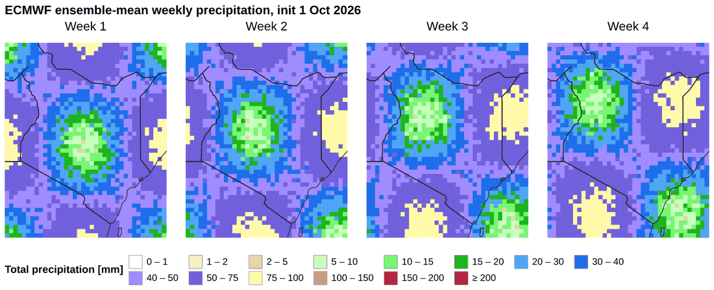

### Side-by-side grids at native resolution

[`examples/map_side_by_side_grids.json`](examples/map_side_by_side_grids.json).
CHIRPS at 0.05° is next to ECMWF at 0.25°, with one binding per input and a
`projection` on each panel. Neither is regridded. This replaces dev's
`subplots[]`.

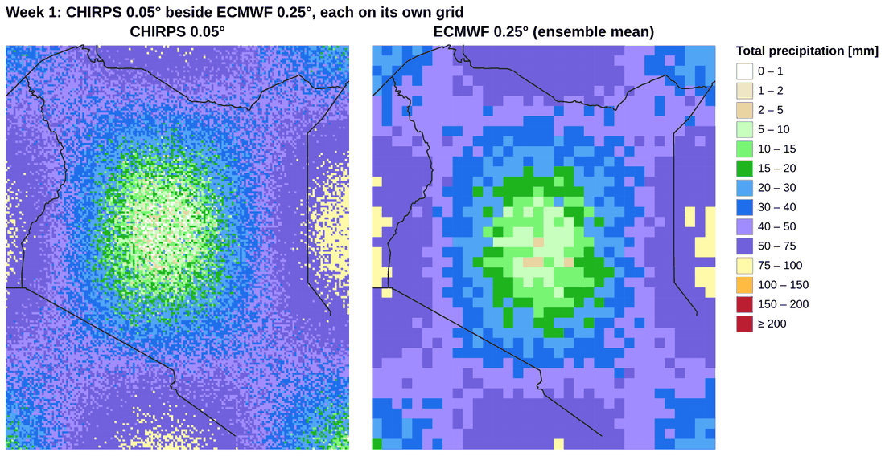

### Anomaly maps: classed and continuous diverging

[`examples/map_anomaly_diverging.json`](examples/map_anomaly_diverging.json).
On the left is `default_precip_anom` with a `$colorbar` underneath. On the
right is the Vega `brownbluegreen` scheme over `{"$extent": "anom.tp",
"symmetric": true}`, which centres white at zero. `resolve.scale.color:
independent` keeps the two panels apart.

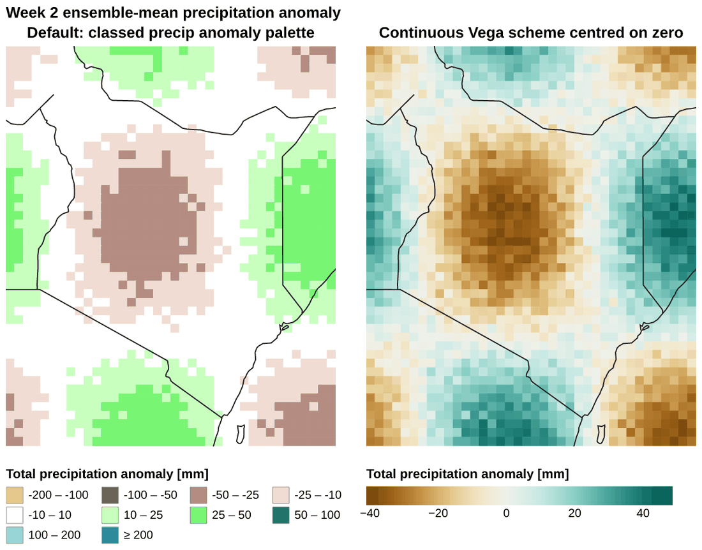

### Quiver (wind arrows over speed)

[`examples/map_quiver_wind.json`](examples/map_quiver_wind.json). Speed is
drawn as `rect` cells, and the arrows come from a second binding of the same
input, thinned with `isel` step 3. An arrow is a `point` mark with an SVG
path `shape` that points up. It is turned by
`angle = atan2(u, v) * 180 / PI` with `"scale": null`, and its length is
linear in speed through a `pow` size scale with exponent 2, because `size`
is an area. The legend reuses the arrow path as its `symbolType`.

```json
"transform": [{"calculate": "sqrt(datum.u*datum.u + datum.v*datum.v)", "as": "arrow_speed"},
              {"calculate": "atan2(datum.u, datum.v) * 180 / PI", "as": "toward"}],
"mark": {"type": "point", "shape": "M0,1 L0,-1 M-0.4,-0.45 L0,-1 L0.4,-0.45",
         "filled": false, "stroke": "black", "strokeWidth": 1.3, "opacity": 1, "clip": true},
"encoding": {"angle": {"field": "toward", "type": "quantitative", "scale": null},
             "size": {"field": "arrow_speed", "type": "quantitative",
                      "scale": {"type": "pow", "exponent": 2, "domain": [0, 12], "range": [0, 1296]}}}
```

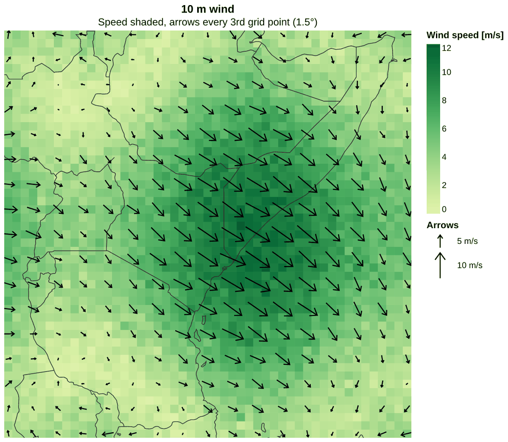

### Filled contours with isolines

[`examples/map_contours.json`](examples/map_contours.json). This recipe uses
the `contours` binding, with bands coloured by `properties.mid` through
`$palette`.

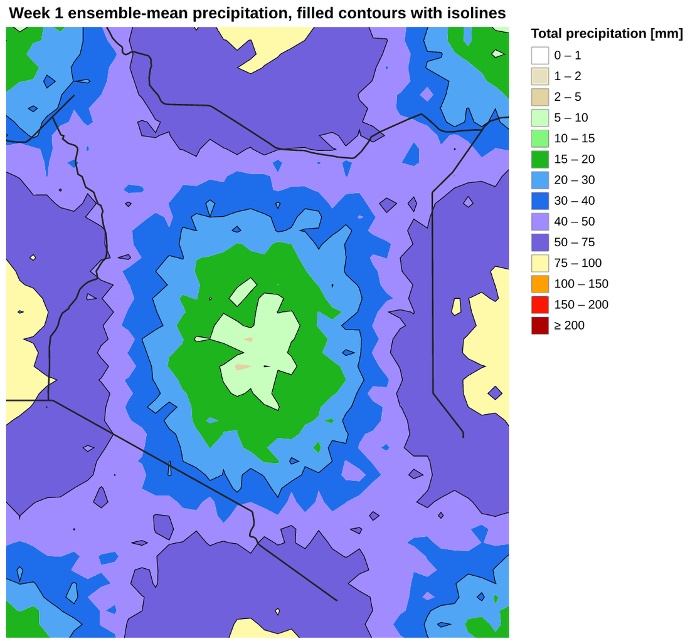

### Ensemble spaghetti with band, mean and climatology

[`examples/timeseries_ensemble_spaghetti.json`](examples/timeseries_ensemble_spaghetti.json).
There are four layers on one `ens` binding (`valid_time`, `number`, `t2m`),
plus a `clim` binding:

- members are thin lines, with `detail` set to member;
- the 10–90% band is `quantile`, then `calculate`, then `pivot`, drawn with
  `area` + `y2`;
- the mean is an `aggregate` line;
- climatology is dashed.

A `{"datum": "..."}` colour on each layer builds one legend, and
`config.range.category` fixes the colours.

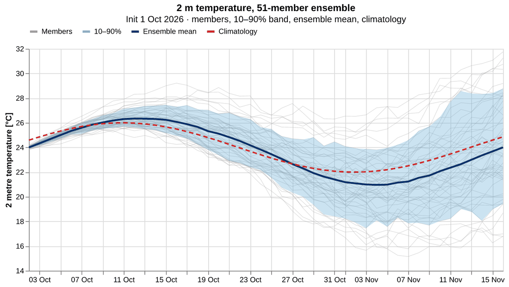

### Multi-panel time series

[`examples/timeseries_multi_panel.json`](examples/timeseries_multi_panel.json).
This is a `vconcat` of members and mean above ensemble-mean anomaly bars. The
anomaly is a `lookup` join against the climatology binding, which only works
with epoch-millisecond times. The bars are coloured with a sign condition.

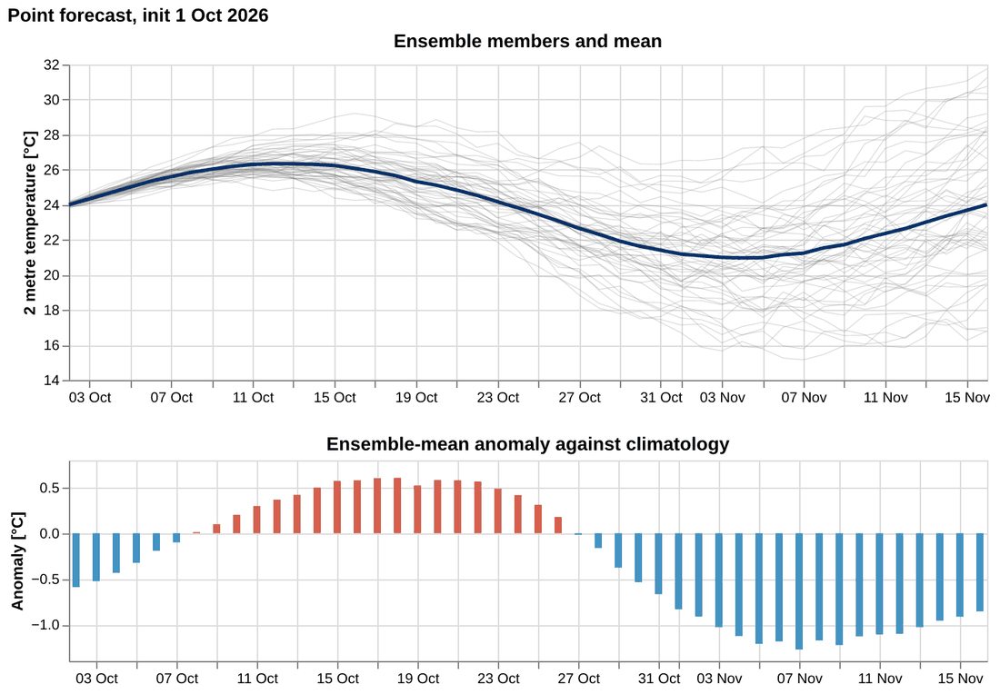

### Grouped bars for comparison

[`examples/bar_model_comparison.json`](examples/bar_model_comparison.json).
Grouping uses `xOffset` by model, with value labels as a text layer on the
same encoding. The input is a score Zarr with `model × lead` dims.

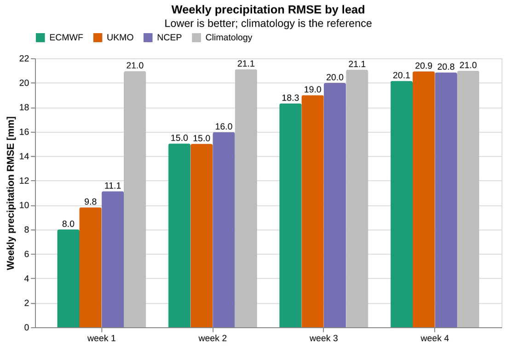

### Box or mediogram by lead week

[`examples/box_mediogram.json`](examples/box_mediogram.json). Weekly means
come from `aggregate`, percentiles from `quantile` and `pivot`, and the
figure is drawn with `bar` (25–75%), `rule` (10–90%), `tick` (median) and a
climatology dot. This replaces `plot-mediogram`.

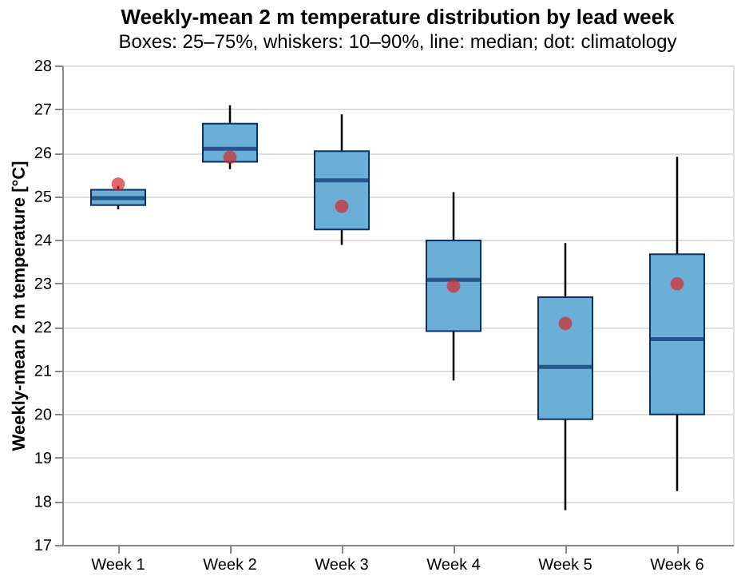

### Wind rose

[`examples/windrose.json`](examples/windrose.json). An `arc` mark uses
`theta`/`theta2` in radians with `scale: null`. The stacked radius comes from
a `window` sum by direction sector, and speed classes come from `calculate`.
Known gap: Vega-Lite has no polar axis, so the radial rings (percent of
time) are missing. One planned fix is a recipe layer of `arc` rings with
`text` labels. The other is a `$polar_grid` placeholder.

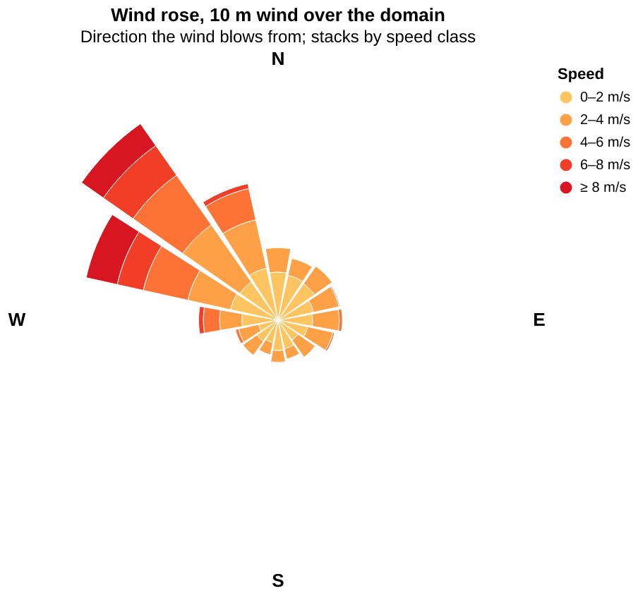

### Recipes still to write before the old skills go

- **Verification grid**, replacing `plot-verify`. Observations sit in the
  first column and forecasts for weeks 1 to 4 to their right (an `hconcat`
  of per-panel projections, or a `facet` when the grids match). The metric
  row is categorical hits, misses and false alarms. That row needs the
  planned `<var>.flag` derived source to label `flag_values` and
  `flag_meanings`.
- **Station time series facet**: `facet` by `station_name` on a
  `station_id × time` Zarr.
- **Scatter with 1:1 line**, forecast against observation.
- **Region outline**: a `--geojson region=...` layer from `resolve-region`.

## Performance and limits

All rows are serialised into the spec as JSON, so the cost scales with the
number of rows. The prototype measured a rect heatmap with base layers
([`prototypes/proto_perf.py`](prototypes/proto_perf.py)):

| Cells | Render | Peak RSS | Spec JSON |
| --- | --- | --- | --- |
| 40k | 2.0 s | 0.49 GB | 4.5 MB |
| 102k | 4.1 s | 0.89 GB | 11.4 MB |
| 202k | 8.2 s | 1.57 GB | 22.6 MB |
| 397k | 15.2 s | 2.77 GB | 44 MB |

That is roughly 25k cells per second and 7 KB of RAM per cell. All twelve
recipes render in about 12 s in total, including interpreter start-up. The
largest, with 34k CHIRPS cells, takes 2 s.

Proposed guard: total bound rows above **150k print a warning**, with
suggestions to `bbox`, `coarsen` upstream or `isel` step. Above **500k the
render fails** unless `--max-rows` is raised. A future fallback for big grids
would be a `raster` binding that renders the field to an image and places it
with an `image` mark. That only works for unprojected or equirectangular
views, so it stays out of scope until someone needs it.

## Package layout and dependencies

```text
src/weather_skills_plotting/
  __init__.py       render(spec, inputs, output, *, geojsons=None, scale=2) and the stage functions
  bind.py           zarr / contours / geojson / naturalearth bindings, cell edges, time encoding
  naturalearth.py   pinned download + cache, clip, d3 orientation, offline fallback
  placeholders.py   $palette $colorbar $bbox $label $attr $extent
  palettes.py       dev theme.py colour tables + precip window selection (no seaborn, no matplotlib)
  validate.py       dispatch, stub-row Altair validation, jsonschema best_match, field lint
  vega.py           vegalite_to_vega, seal_cells, vega_to_png / HTML
  qa.py             unchanged
skills/plot/
  SKILL.md
  scripts/plot.py   CLI, @weather_skill, named-input holder, --describe / --dump-spec
  recipes/*.json    the examples above
  references/       bindings.md, placeholders.md, recipes.md (with images), maps.md (gotchas)
```

Dependencies:

- **Removed**: `matplotlib`, `seaborn`, `cartopy` and `nc-time-axis`.
- **Added**:
  - `altair>=6.3` (Vega-Lite 6.4 schema);
  - `vl-convert-python>=1.9`, pinned exactly, because a renderer bump can
    move pixels;
  - `contourpy>=1.3`;
  - `pandas`.
- **Kept**: `shapely`, `xarray`, `zarr`, `numpy`, `cf-xarray`, `pint-xarray`,
  `cftime` and core. `pillow` stays for `qa.py`.

vl-convert ships wheels with an embedded Deno runtime for Linux, macOS and
Windows, so no browser or Node is needed. It bundles Vega-Lite 5.21, 6.1 and
6.4, and the skill pins `vl_version="6.4"`.

**Fonts.** vl-convert renders text with the system fonts it finds, which
makes text pixels differ between machines. The skill should bundle one
open font, such as Liberation Sans or Inter, call
`vl_convert.register_font_directory` on it, and set `config.font` as the
single styling default. This is the one default beyond palettes worth
adding, because it is what makes `plot hash` reproducible across CI and
laptops.

## Testing plan

- **Unit tests**:
  - cell edges on ascending and descending, uneven and length-1 coords;
  - `sel`/`isel` forms;
  - the leftover-dim error;
  - `valid_time`, epoch milliseconds and timedelta days;
  - Natural Earth clipping and orientation (the winding test that caught the
    world-fit bug);
  - every placeholder;
  - dispatch for every top-level key;
  - the field lint cases (transforms, inline data, pivot);
  - `seal_cells` touching only scale-filled rects.
- **Recipe tests**: render every `recipes/*.json` against small synthetic
  Zarrs (the prototype's `make_data.py` moves to `tests/`). Each test checks
  that the PNG exists, has the expected size, is not blank, and that the
  stdout row counts match. Pixel-hash golden files are only used with the
  bundled font and a pinned vl-convert.
- **Error tests**: each documented error message, so the wording an agent
  relies on does not drift.
- **CI**: the existing ruff, inline-deps, pytest and `--help` jobs. Natural
  Earth tests use a checked-in clipped fixture, so CI needs no network.

## Implementation phases

1. **Library.** Move the bindings, placeholders, palettes, validation and
   Vega stages from `prototypes/vlbind.py` into the package layout above,
   and add unit tests. Drop matplotlib-backed modules from
   `weather_skills_plotting`.
2. **Skill CLI.** Add `plot.py` with `-i NAME=PATH`, `--geojson`, `--spec`,
   `--describe`, `--dump-spec`, `-o png/jpg/html`, the `@weather_skill`
   integration, the row guard and the QA lines.
3. **Recipes and docs.** Add the recipes, `SKILL.md`, the `references/*.md`
   files with images, recipe tests in CI and a bundled font.
4. **Migration.**
   - Delete `plot-timeseries`, `plot-verify` and `plot-mediogram`.
   - Rewrite `agents/plotting.md` around one skill and the recipes.
   - Update the `.claude-plugin` descriptions and keywords (matplotlib and
     cartopy become vega-lite and altair).
   - Replace `docs/plotting.md` with the references.
   - Remove dev's spec tests.
5. **Gaps.**
   - The `<var>.flag` source and the verification-grid recipe.
   - Wind rose rings.
   - `usermeta.fit_aspect`.
   - Optional `units` conversion in bindings (for example K to °C through
     pint), which today is an upstream transform.

## Proposed SKILL.md structure

```text
---
name: plot
description: Render any figure from weather-skills Zarrs with a Vega-Lite spec: maps (grid heatmaps, contours,
  quiver, station dots over Natural Earth borders), time series (ensemble spaghetti, bands, anomalies), bars, boxes,
  wind roses, facets and side-by-side panels. Name inputs with -i NAME=PATH; bind them under the spec's top-level
  "datasets"; everything else is plain Vega-Lite. Start from a recipe in recipes/. ...
---
# plot
1. The contract in 10 lines (inputs → datasets bindings → {"data": {"name"}} → PNG)
2. Workflow: --describe → copy a recipe → edit → render → look at the PNG → --dump-spec into the Vega Editor if stuck
3. Bindings (short table; full reference in references/bindings.md)
4. Placeholders (short table; references/placeholders.md)
5. Recipe index: one line + thumbnail per recipe, linking recipes/*.json and references/recipes.md
6. Maps: the five rules (projection.fit with $bbox, clip: true on every layer, one projection per panel,
   repeat the $palette for stations, resolve legends) → references/maps.md
7. Errors you will see and what they mean
8. Output, provenance, QA lines, limits
```

The `SKILL.md` stays short and front-loads the contract and the recipe
index, following the Agent Skills progressive-disclosure pattern. The long
references load only when needed.

## Open decisions for review

1. **Where bindings live.** The proposal is inside `datasets` (one
   document). The alternative is a separate `--bind` JSON with a pure
   Vega-Lite `--spec`.
2. **Skill name.** Should the new skill reuse `plot`, so the agents and
   plugin keep their names, or use a new name such as `plot-vega` with the
   old skills deleted in the same PR?
3. **`seal_cells` on by default.** The proposal is on. It changes no
   semantics, and `usermeta.seal_cells: false` turns it off.
4. **Datetime encoding.** The proposal is epoch milliseconds, which is
   robust for joins. ISO strings are easier to read in `--dump-spec`. A
   middle ground is epoch milliseconds in the render and ISO strings in
   `--dump-spec-rows` output.
5. **Row limits.** The proposal is a warning at 150k and an error at 500k.
6. **Contours in the skill.** The proposal includes contourpy, which is
   small and numpy-only. The alternative is a separate `contour` transform
   skill that writes GeoJSON.
7. **Colorbar approach.** The proposal is `$colorbar` as a concat panel. The
   alternative is to accept Vega's value-proportional threshold legend.
8. **Natural Earth delivery.** The proposal is a pinned download with a
   cache and a 110m offline fallback. The alternative is to vendor the 10m
   and 50m files, which is too big for the plugin: the 10m coastline alone
   is 10 MB and 10m lakes is 5 MB.
9. **A bundled font** as the only styling default, for reproducible hashes.

## Running the prototype

```bash
cd docs/design/vegalite/prototypes
uv run make_data.py        # synthetic Zarrs → data/ (git-ignored)
uv run run_examples.py     # every ../examples/*.json → out/ (git-ignored)
uv run run_examples.py map_quiver_wind   # just one
```

The other `proto_*.py` scripts are the A/B experiments behind the gotchas
table:

- seams (`proto_ab.py`, `proto_seams.py`);
- projection fit and winding (`proto_debug.py`);
- legend merging (`proto_legend_merge.py`);
- error messages (`proto_errors.py`);
- scaling (`proto_perf.py`).

## References

- Vega-Lite: [projection and fit](https://vega.github.io/vega-lite/docs/projection.html),
  [geoshape](https://vega.github.io/vega-lite/docs/geoshape.html),
  [named datasets](https://vega.github.io/vega-lite/docs/data.html#datasets),
  [threshold scales](https://vega.github.io/vega-lite/docs/scale.html#threshold),
  [legends](https://vega.github.io/vega-lite/docs/legend.html),
  [resolve](https://vega.github.io/vega-lite/docs/resolve.html),
  [top-level spec and `usermeta`](https://vega.github.io/vega-lite/docs/spec.html)
- [Altair](https://altair-viz.github.io/) (6.x, Vega-Lite 6 schema)
- [vl-convert](https://github.com/vega/vl-convert) (Deno + resvg renderer, font registration)
- [d3-geo](https://github.com/d3/d3-geo) (spherical polygon winding: clockwise exterior rings)
- [natural-earth-vector](https://github.com/nvkelso/natural-earth-vector) (`v5.1.2` GeoJSON)
- [contourpy](https://contourpy.readthedocs.io/)
