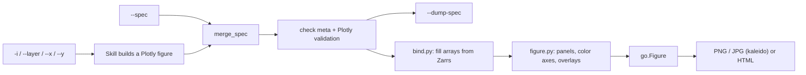

# Plotting skills

How the figure stack works. Agent how-tos live in each skill's
[`SKILL.md`](../skills/plot/SKILL.md); this page is the design.

## The spec is a Plotly figure

Every skill's `--spec` is a standard Plotly figure, `{"data": [...], "layout": {...}}`.
Plotly validates every key except `meta`, which Plotly allows on any trace and
on `layout` without looking inside. The weather-skills bindings live there:

- `data[].meta` says what a trace draws: which input and variable
  (`source`), how its arrays are filled (`bind`), which dim panels (`facet`),
  how a series fans out (`along`, `band`), and which class palette colors
  it (`palette`).
- `layout.meta` holds figure-wide map settings: `geo.bbox`,
  `geo.mask_geojson`, `geo.point`, `overlays`, and the `inputs` paths.

Everything else is plain Plotly and documented at
<https://plotly.com/python/reference/>. Agents already know that schema, so
there is no custom key table to learn, and Plotly's validator rejects a
misspelt key with a suggestion (`Did you mean "colorscale"?`). The `meta`
blocks are checked by `spec.check_meta`, which lists the allowed keys on any
error. The spec has no version-2 compatibility: a spec with the old top-level
keys (`inputs`, `traces`, `geo`, `theme`, …) is rejected with a pointer here.



## Merging

`merge_spec(base, overlay)` deep-merges `--spec` onto the figure the skill
built:

- `data[]` merges by `uid` (Plotly's trace identity), else by position. A new
  `uid` appends a trace, which is how a user adds plain Plotly traces such as
  city markers or a box outline.
- `layout.annotations`, `shapes` and `images` merge by `name`, so
  `{"name": "panel-title-2", "text": "…"}` renames one panel title.
- Everything else is a recursive dict merge, and the user wins.

`--dump-spec` prints the merged spec before any data is loaded. It is small
because it has no arrays. Its `layout.meta.inputs` keeps the file paths, so a
dumped spec replays without file flags.

## Binding (`bind.py`)

| `meta.bind` | Plotly type | Fills |
| --- | --- | --- |
| `field` | heatmap, contour | `z` on lon/lat; one panel per `facet` value (default `step`/`time`); `number` averaged |
| `speed` | heatmap, contour | wind speed from u/v |
| `arrows` | scatter | arrow polylines from u/v (`meta.arrows.step` / `.scale`) plus a 10 m/s key |
| `points` | scatter | station markers colored by value |
| `geojson` | scatter | boundary lines from a GeoJSON file; repeats on every panel |
| `series` | scatter, bar | one line (or `along` fan, `band`) along time or valid time |
| `pair` | scatter | one series against another, joined on time / year / index |
| `samples` | box, scatter | all samples per step (box) or their mean (scatter) at a point |
| `windrose` | barpolar | one barpolar trace per speed class, frequency in percent |

The default bind follows the trace type (`heatmap` → `field`, `barpolar` →
`windrose`, …). Units go through `to_standard_units` and `precip_for_display`
as before. Nothing is averaged silently: a dim left over after
`isel` / `sel` / `reduce` / `facet` / `along` is an error that names the fix.

## Assembly (`figure.py`)

- **Panels.** Map traces group by their `xaxis` anchor. Traces on the same
  axes are layers, and traces on `x2`, `x3`, … are side-by-side panels, each
  on its own lat/lon grid. One faceted group expands into one panel per
  value; static layers (outlines, plain traces, single-time fields) repeat on
  every panel. Unfaceted side-by-side traces keep their axis number as their
  grid cell, so empty cells are allowed (`plot-verify` leaves one).
- **Map axes.** Map axes are equal-degree lon/lat axes (`scaleanchor`), which
  is the PlateCarree projection the cartopy version used. Plotly's geo
  subplots cannot hold a heatmap, so they are not used.
- **Layout.** Plotly has no constrained-layout engine, so `layout.py` sizes
  the canvas from the map aspect and computes panel domains, title room and
  colorbar positions: one bar right of a single panel, a shared bar under a
  grid, or a bar beside the panels it covers.
- **Color axes.** Each color-scaled source trace gets a `coloraxis`. Traces
  that name the same `coloraxis` share it, and same-variable layers on one
  map share automatically. Trace-level `colorscale`, `zmin`/`zmax`
  (`marker.cmin`/`cmax`) and `colorbar` are lifted onto the axis.
- **Class palettes.** Precipitation, SPI and percent-of-normal fields get the
  CHC class palettes. Plotly color scales are linear, so values become class
  indices with a stepped colorscale and ticks at the class edges, while the
  raw values stay in `customdata` for hover. User limits turn a class palette
  into a continuous scale.
- **Overlays.** Natural Earth coastline, borders, lakes, rivers and admin-1
  become line traces, at a scale chosen from the map span. Cartopy is used
  only to download and cache the shapefiles.
- **Defaults.** Titles, colorbar labels, sizes and the `weather_skills`
  template fill only what the user leaves unset; the user's `layout` is
  merged last.

## Output

The `-o` suffix chooses the format: `.png`, `.jpg` (kaleido and headless
Chrome, rendered at 2×; `layout.meta.export.scale` changes it), or `.html`
(self-contained, interactive, works offline). Images print a pixel
`plot hash` and a `data: not null | NULL` line. Provenance is embedded by the
core decorator, in PNG `tEXt` chunks or an HTML `<meta>` tag.

PNG export needs Chrome. kaleido uses an installed Chrome; otherwise run
`plotly_get_chrome -y` once. CI does this before pytest.

## Python surface

```python
from weather_skills_plotting import compile, export, load_spec, merge_spec

fig = compile(spec, {"a": dataset})  # plotly.graph_objects.Figure
export(fig, "out.png", datasets={"a": dataset})
```

## Skill catalog

| Skill | Job | Inputs | Built traces |
| --- | --- | --- | --- |
| [`plot`](../skills/plot/SKILL.md) | maps, series, xy, wind rose | `-i`, `--layer KIND:PATH`, `--x`/`--y` | one per file: heatmap / points / series / pair |
| [`plot-timeseries`](../skills/plot-timeseries/SKILL.md) | many series on one time axis | repeatable `-i` | one `series` per input; `data[0]` settings inherited |
| [`plot-verify`](../skills/plot-verify/SKILL.md) | obs / lead forecasts / verify grid | `--obs`, `--forecast`, `--verify` | 2-row grid, two color axes |
| [`plot-mediogram`](../skills/plot-mediogram/SKILL.md) | ensemble vs m-climate at a point | forecast + m-climate `-i` | two `box` traces and a mean line |

A shared lat/lon grid is needed only by `difference` and `verify`. Do not
coarsen or downscale just to draw. Precipitation figures expect totals
(`mm`): run `aggregate-temporal`, then `convert-to-totals`.
